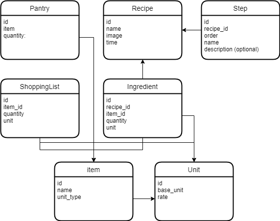

# Recipe Manager

Recipe Manager is an application which manages pantry and recipes based on the 
ingredients available in the pantry. This application has three main scopes of managing a kitchen.

### Pantry

 - Pantry contains all the items in the kitchen essential for cooking a recipe along with their quantity.
 - We can add items to the pantry and manage them.

### Recipes

 - Recipes contains all the recipe to cook with the ingredients needed and the procedure.
 - We can add new recipes with procedure and ingredients needed.
 - Shows the recipes to cook based on the items availability in pantry.
 - Cooking the available recipe will decrease the ingredients quantity from pantry.
 - Allows us to add the unavailable items to shopping list.

### Shopping list

 - Shows the items to shop.
 - Allows us to add an individual item to shopping list.
 - Item bought from the shopping list will update the pantry.      

## Models

### Class Diagram

#### Item

It is a registry of all items and its base unit of calculation.

#### Unit

It is a registry of all units and its base unit with conversion rate.

#### Pantry

Pantry contains Item and its quantity available for cooking.

#### Recipe

This contains name, image and the cooking time of the recipe

#### Ingredient

It contains item, quantity and unit for the recipe

#### Step

Step contains the step order number with step name and detailed procedure of the recipe

#### ShoppingList

It contains quantity and unit of item to buy

## Pages Functionality

### Index page

It shows menu for three scopes of the project. [**Pantry**](#pantry-page), [**Recipes**](#recipe-page) and [**Shopping list**](#shopping-list-page)

### Pantry page

 - It shows us the list of available items in pantry with quantity and unit.
 - `Add Item` button in pantry page allows us to add items to the pantry.
     - If the added item is already present in the pantry, the quantity gets increased for that item.
     - If not present,
       - Check if the item already exists in the Item table, add otherwise.
       - Add the new item in the Pantry table.

### Recipe page

 - It lists all the recipes.
 - Clicking on a recipe opens the [Recipe view page](#recipe-view-page).
 - Recipe page has two buttons, [Recipe Availability](#recipe-availability-page) and [Add Recipe](#add-recipe-page).
 
### Add recipe page

 - It allows us to add new recipe by filling the form.
 - Can add multiple ingredients using `Add next ingredient` button. Added ingredients will be listed above ingredient creation fields for reference.
 - Can add multiple steps using `Add next step` button. Added steps will be listed above step creation fields for reference.
 - Submitting this page will add recipe to Recipe table, steps to Step table, ingredients to Ingredient table, and any new items to Item table. 

### Recipe view page

 - It shows us all the details about a recipe such as name, image, cooking time, ingredients and procedure with steps to cook.

### Recipe availability page

 - It shows recipe status based on the items available in pantry.
 - Recipes list in Available recipe category are ready to cook, i.e. all the ingredients are present in pantry.
 - Recipes in unavailable category does not have one or more ingredients available or not in enough quantity in pantry.                
   - Available recipe:
     - Clicking on any of the recipe from available list displays the [Recipe view page](#recipe-view-page) with `Cooked this recipe` button.
     - Upon clicking `Cooked this recipe` button, the ingredients quantity will be reduced from the pantry.
   - Unavailable recipe:
     - Clicking on any of the recipe from unavailable list displays the [Recipe view page](#recipe-view-page) with `Add to shopping list` button.
     - Upon clicking `Add to shopping list` button, all the ingredients of the recipe are added to the shopping list table.

### Shopping list page

 - It lists all the items to buy.  
 - Allows us to add individual items to shopping list using `Add item` button. (Same functionality as in [Pantry page](#pantry-page)'s `Add item` button)
 - Shopping list page displays the items added from the unavailable recipe view page and also from add item button.
 - `Item bought` button updates the pantry with the quantity of item bought. We can enter the quantity and the unit of item bought.
 - `Remove item` button removes the item from the shopping list without updating the pantry.
   
## Specification:

  - Uniqueness of project:
    - It will not resemble any of the projects taught in the course or copy from others.
    - It is an own concept designed to use on daily basis.
  - Django Model and JavaScript:
    - It uses [7 models](#models) for Django.
    - It uses JavaScript for adding ingredients and steps in [Add recipe](#add-recipe-page) form.
  - Responsive design:
    - Designed to work in mobile displays as well.
  - Design and complexity:
    - In order to have a clear shopping list, collection of recipes and manage the pantry effectively, I created this project. 
    - It is created for my own use to help manage my kitchen efficiently.
    - I used HTML, CSS, Python with Django and Javascript for the development of this project. No additional packages were used.
    - I creating this application from what I learned through this course. Provided I haven't done any websites before, I believe this application stand unique.
    - I am really happy to have completed such complex application through this course. I used all the technologies I learned in this project.
